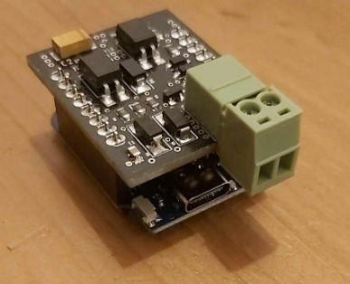

# Wemos OpenTherm shield
OpenTherm shield for wemos d1 mini based on https://github.com/ihormelnyk/opentherm_library

# Homessistant configuration
Programm the device with the shield disconnected

1. In the Homeassitant / ESPHome tab add a new device 
2. Name it as you wish & press next button 
3. Press skip this step, select the device esp8266 / esp32 
4. On the congratulations tab press skip as well
5. Edit the newly created device
6. Insert the following code below the generated code
    ```
    external_components:
    source: github://arthurrump/esphome-opentherm@main

    opentherm:
    in_pin: 5
    out_pin: 4
    ch_enable: true
    dhw_enable: true

    sensor:
    - platform: opentherm
        rel_mod_level:
        name: "Boiler Relative modulation level"
        t_boiler:
        name: "Boiler water temperature"
        t_ret:
        name: "Boiler Return water temperature"
    ```
7. Press save and then install button
8. Press and hold the reset button and then plug in the wemos device esp8266 / esp32 via a USB cable
9. Press connect and select COM port of the connected device and press Connect
10. Assemble the shield, see #Assembly 

Addidional configuration options might be available, but it deppends on the heating device
For reference try https://github.com/arthurrump/esphome-opentherm/blob/main/examples/thermostat-pid-complete.yaml

# Assembly
The shiled should be assembled as a hat for ESP8266 / ESP wemos kits.
The cable connector should align with USB socket. 

