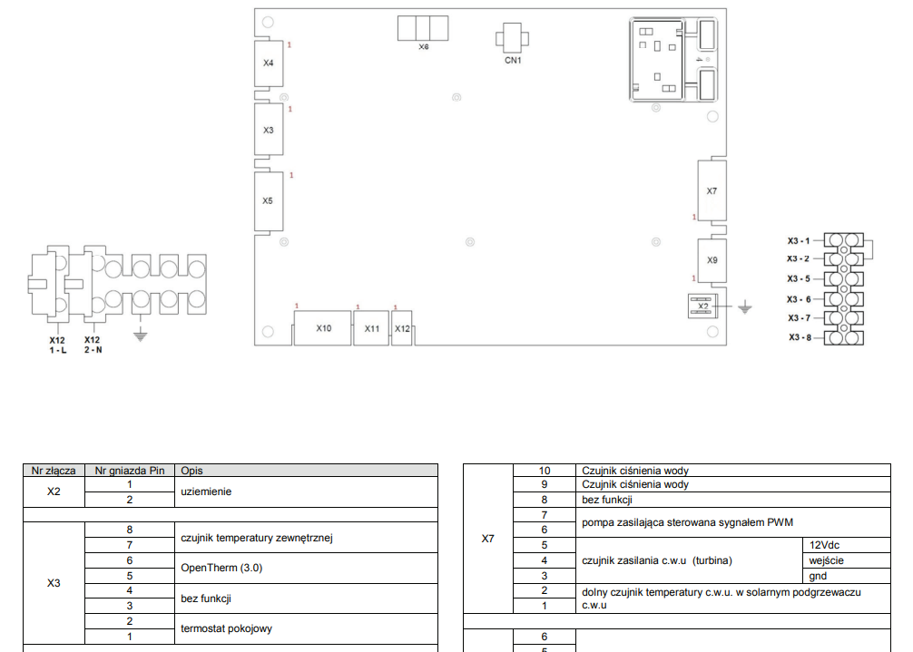

# Wemos OpenTherm shield
OpenTherm shield for wemos d1 mini based on https://github.com/ihormelnyk/opentherm_library

# Homeassistant configuration
Program the device with the shield disconnected

1. In the Homeassistant / ESPHome tab add a new device 
2. Name it as you wish & press next button 
3. Press skip this step, select the device esp8266 / esp32 
4. On the congratulations tab press skip as well
5. Edit the newly created device
6. Insert the following code below the generated code
    ```

    external_components:
      - source: github://olegtarasov/esphome-opentherm
    
    opentherm:
      in_pin: 4
      out_pin: 5
    
    
    switch:
      - platform: opentherm
        ch_enable:
          id: ot_ch_enable
          name: "Central Heating enabled"
          restore_mode: RESTORE_DEFAULT_OFF
        dhw_enable:
          id: ot_dhw_enable
          name: "Hot Water enabled"
          restore_mode: RESTORE_DEFAULT_OFF
    
    
    number:
      - platform: opentherm
        t_set:
          id: ot_setpoint
          name: "Heating setpoint"
          min_value: 22
          max_value: 40
          restore_value: true
          initial_value: 25
    
        t_dhw_set:
          id: dhw_setpoint
          name: "Hot Water target temperature"
          min_value: 25
          max_value: 50
          restore_value: true
          initial_value: 42
    
    sensor:
      - platform: opentherm
        rel_mod_level:
          id: ot_rel_mod_level
          name: "Boiler Relative modulation level"
        t_boiler:
          id: boilotron_temperature_ch
          name: "Boiler Feed Temperature"
    
    
    binary_sensor:
      - platform: opentherm
        ch_active:
          id: ot_ch_active
          name: "Boiler Central Heating active"
        dhw_active:
          id: ot_dhw_active
          name: "Boiler Hot Water active"
        flame_on:
          id: ot_boiler_flame_on
          name: "Boiler Flame on"

    # Based on https://olegtarasov.me/opentherm-thermostat-esphome/
    ```
7. Press save and then install button
8. Press and hold the reset button and then plug in the wemos device esp8266 / esp32 via a USB cable
9. Press connect and select COM port of the connected device and press Connect
10. Assemble the shield, see #Assembly 

Additional configuration options might be available, but it depends on the heating device
For reference try https://github.com/arthurrump/esphome-opentherm/blob/main/examples/thermostat-pid-complete.yaml

# Assembly
The shield should be assembled as a hat for ESP8266 / ESP wemos kits.
The cable connector should align with USB socket.
Please see  for specific pinout.

Example shows wemos d1 v4 with USB C connector, for MicroUSB version please consult pinout


# Boiler connection 
OpenTherm is a 2 wire bus, you should connect the pins on the shield to corresponding pins in the boiler. 


# Disclaimer  

By using this electronics project, you acknowledge and accept that there are inherent risks associated with working with electronic components, circuits, and devices. You agree to assume all such risks and agree to use appropriate safety precautions.

The creators and contributors to this project have made efforts to ensure the accuracy and reliability of the information provided. However, they cannot guarantee that the information is error-free or that the project will work as intended in every circumstance.

The shield project is provided on an "as-is" basis. The creators and contributors to this project make no representations or warranties, either express or implied, including but not limited to, any warranties of merchantability or fitness for a particular purpose.

In no event shall the creators, contributors, or sponsors of this project be liable for any direct, indirect, incidental, special, exemplary, or consequential damages (including, but not limited to, procurement of substitute goods or services; loss of use, data, or profits; or business interruption) arising in any way out of the use of the project.

